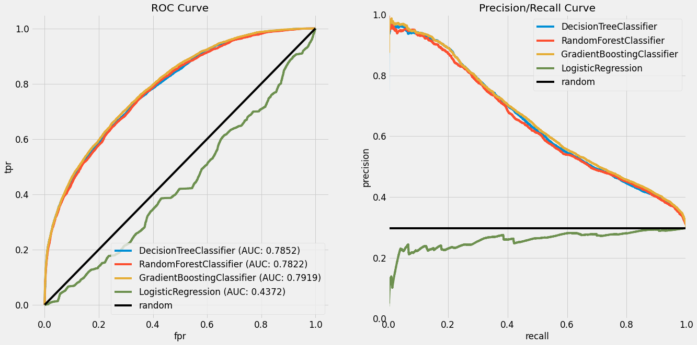
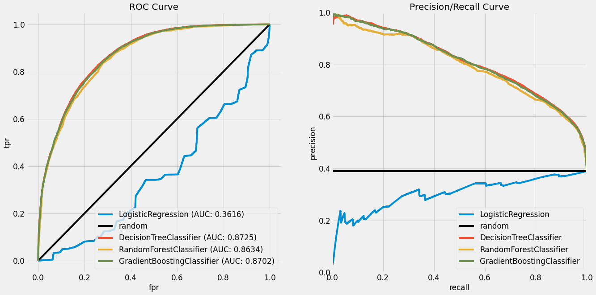
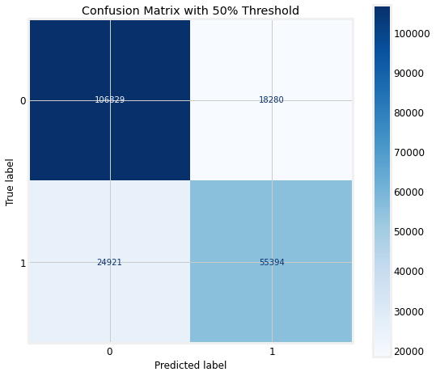

# Identifiying Over Performing US MovieTheaters

## Background
With the ever-changing theatrical landscape, it is now more important than ever to maximize a Film's Box Office success at a theatre. As the theatrical window (the time period between when a movie is played in theatres to when it ends up on screen at home) is growing smaller and smaller, so does it's chances for generating revenue. A film that could have spent weeks and weeks steadily holding over it's gross week-to-week, now may not get that same chance given today's landscape. 

To help target certain locations that would maximize a Film's per location gross, I worked to develop a predictive model that would identify Theatre's that strongly performed above their own average gross, given the type of Film that was playing. 

## The Data
The data set for this project was built upon many similar data sources, all providing different feautre's for a Film.
1. Booking Information: Provided from confidential source. 1,000,000 rows spanning the all the playweeks of a Studio's slate, from 2017-2019.
    * From this initial data set, data clean-up was performed, and the scope of the project narrowed down to primarily targeting the First Play Week of First Run theatres, the initial Wide wave of theatre's playing a Film on release.
    * Some Features that were included: Name of Theatre (Anonymized), Film being played, Boxoffice generated, Division/City/State of the Theatre
2. The Movie Database (TMDb): Provided Budget, Runtime, and Plot Overview fields to help add more feature's into the dataset. 
3. Box Office Reporting: Opening Weekend to YT Views: Metrics tracked by Box Office Reporting, tracks views from the official YouTube sources, as well as Fandango. Counting is stopped on the Saturday prior to release
4. Internal Metadata report: Film features include Season, Genre, and Number of Locations when a Film was released.

## Data Clean-Up and Preparation
The bulk of the work for this dataset came from finding a way to neatly tie all of these sources together. They all provided their own unique method of labelling, where one film could be titled in four different ways. I employed a function that utilized the *difflib* Python library, that looked to match a target word from a selection of available choices. Other methods considered were *FuzzyWuzzy* lookup and Levenshtein measurement for vector similarity. Even after employing a matching function, there were still a few datapoints that needed manual intervention and attention. 

To create my 'target feature' for this classification project, I estblished a threshold at each theatre+film level that the Box Office gross needed to surpass to be considered **over-index**. This threshold was based off a theatre's own performance, given a certain Genre. This was a binary classification, where 1 was the case when a theatre+film combination over performed, and 0 was when it did not pass the threshold. 

So if Theatre X was playing Y Genre, and on average, grossed $1,000 dollars for Y Genre, then the film would need to surpass $1,000 dollars in Boxoffice to be conisdered **over index**.

* Overall, there were 54 titles within the movie dataset.
* The Opening Week dataset consisted of 6,000 unique theatres, and over 200k rows of Theatre + Film combinations. 
* Of those 200k records, around 80k Over Indexed

## EDA

Looking at the distribution of Theatres+Films that did Over-Index, the large majority of data falls around the 20-film mark, meaning if a location played all 54 Film's in the dataset, almost half of them over performed.

Here is a breakdown and an example of what cities have been performing better than their average. 

### Top 10 Cities with the Highest Over-Index Rate (with at least 54 Movies)
|                           City | over_indexcount | over_indextotal | over_index_% |
|-------------------------------:|----------------:|----------------:|-------------:|
|                   NEW BERN, NC |              35 |              57 |     0.614035 |
|                  PARAMOUNT, CA |              42 |              81 |     0.518519 |
|                     YAKIMA, WA |              31 |              60 |     0.516667 |
|                 WHITEHORSE, YU |              32 |              62 |     0.516129 |
|               ORANGE BEACH, AL |              29 |              59 |     0.491525 |
|                 ZANESVILLE, OH |              28 |              57 |     0.491228 |
| IDAHO FALLS, ID #1 IDAHO FALLS |              58 |             120 |     0.483333 |
|             BONITA SPRINGS, FL |              27 |              56 |     0.482143 |
|                  WENATCHEE, WA |              34 |              71 |     0.478873 |
|               NEW ROCHELLE, NY |              30 |              63 |     0.476190 |

This may give us an idea of *where* the business might want to potentially target for a new release.

So what kinds of Film's are we working with here? To continue my exploratory data analysis, I first segmented the Over-Indexed values down by Rating. 

PG13 films account for more that 266% of the Over-Indexed data points than their PG counterpart, due to the large part that there aren't quite as many PG films rated within the dataset. PG13 films tend to be the most popular at the box office, as they have the widest appeal to audiences. 

Further breaking down this distribution, I examined the Over-Indexed counts by Genre.

 Here, we see a large lead for the Action/Adventure genre. This could most likely be due to the fact that many Summer and Holiday blockbusters fall into this Genre, and like we saw above, which usually garner a PG13 rating. 

It's interesting to see Comedy in second place, as the genre has not been as popular as it was compared to the last decade. A sign that the genre still has the ability to perform well at the Box Office, better than some of us think. 

### Top OI% from Division+Genre Combination

| Division |           Genre | over_indexcount | over_indextotal | over_index_% |
|---------:|----------------:|----------------:|----------------:|-------------:|
| SOUTHERN | Romantic Comedy |            1100 |            2197 |     0.500683 |
| SOUTHERN |  Sci-Fi/Fantasy |            1146 |            2311 |     0.495889 |
| SOUTHERN |  Romantic Drama |             727 |            1482 |     0.490553 |
|  WESTERN |  Sci-Fi/Fantasy |            1057 |            2194 |     0.481768 |
|  EASTERN |  Sci-Fi/Fantasy |            1522 |            3171 |     0.479975 |
|  WESTERN | Romantic Comedy |            1050 |            2188 |     0.479890 |
|  EASTERN | Romantic Comedy |            1416 |            2976 |     0.475806 |
|  EASTERN |  Romantic Drama |             872 |            1848 |     0.471861 |
| SOUTHERN | Children/Family |             496 |            1053 |     0.471035 |
|  WESTERN |  Romantic Drama |             618 |            1317 |     0.469248 |

Looking at the breakdown by division, the major genre's relate to Romance movies (Comedy or Drama) and Science Fiction/Fantasy. Though no clear genre over indexes above 50%, further analysis and segmentation needs to be done to identify any clear strong regional genre favorite.

Lastly, I took a look at the total counts of Over-Indexed values by Season. Again, to further agree with my previous two graphs, Summer holds a substantial lead from the next season. Christmas and Thanksgiving rank at the bottom of this list, though Film's in this bucket may perform strongly (high box office gross) during this period, but may have established a high average that is hard to over-perform.

### Table of over indexed counts, and Theatre's percentage of film's that over indexed. 

|       Season | over_indexcount | over_indextotal | over_index_% |
|-------------:|----------------:|----------------:|-------------:|
|       Summer |           24799 |           66253 |     0.374308 |
|         Fall |           18849 |           43951 |     0.428864 |
|       Winter |           13392 |           29885 |     0.448118 |
|       Spring |           12987 |           38265 |     0.339396 |
|    Christmas |            6232 |           14763 |     0.422136 |
| Thanksgiving |            3880 |           12307 |     0.315268 |

Looking more into detail of the Season breakdown, it is interesting to examine the Winter values 
(Winter is defined as January to February): 
* Winter has the 3rd highest Over Index Count, while having the 3rd lowest Over Index total
* Winter also has the highest Over Index percent, at 44%
* January, and by extension February, has long been thought of as a 'dumping ground' for Film's, where a release during this time typically means a quick and unmemorably exit from the box office in a few weeks time. 
* It appears as if some Film's are exceeding the low bar of the Season, and are having the chance to out-perform their lowly average, and over-index. 
    * Though, values could also be accounted for from February, which has been also improving in performance as a month

## Modelling
To establish a naive baseline for my predictive model, I reset my threshold to be the average Boxoffice from the entire dataset. With this new baseline, I was left with 55k records that had over indexed. None of the features were standardized, nor was any resampling done to address the class imbalance (150k Class 0 Records : 55k Class 1 Records).

The Numeric features included in this model are:
* Budget
* Runtime
* Number of Locations in First Week
* Opening Weekend to YouTube trailer views Ratio

The Categorical Features included are:
* Genre 
* Season 
* Rating
* Media Format played (2D,3D,IMAX)
* Division located

I divided this Baseline data into a train/test split, and ran it through 4 models, with no hyperparameter tuning. 
These models were: 
* Logistic Regression (LR)
* Decision Tree (DT)
* Random Forest (RF)
* Gradient Boosting (GB)

### Baseline Model
I wantd to focus on the Precision/Recall tradeoff of my model, to identify the relationship between how my model was identifying False Positives and False Negatives.
| Model        | LR     | DT     | RF     | GB     |
|--------------|--------|--------|--------|--------|
| Recall Score | 0.4436 | 0.4021 | 0.4021 | 0.3700 |

Specifically, I wanted to make sure to improve the Recall score for my model as I iterated throughout the process. Recall would improve against identifying False Negatives. A False Negative in this case, would mean that we missed to identify a theatre that over-performeed, missing out on potential revenue. False Positives on the other hand, would mean that a theatre shows a film, and does not quite gross over it's average. 
This is acceptable in a few cases: 
1) The theatre in question is possibly the only theatre in X amount of miles, meaning it would be the only location in the area showing the content
2) Sales and Politics: Film Buyers are the agents responsible for negotiating with the studio, to place the film's in the theatres they work for. They may have set agreements with their theatres to receive certain films, even if the Studio knows it may not be a strong performer or has the opportunity to over-index. 

### Threshold - Genre Average Per Location

I iterated my model by tweaking the threshold I had set. I narrowed down the focus from the global average, to a Genre's Average per location. Though this helped course correct my Logistic Regression model, the overall Area Under the Curve metric did decrease slightly
| Model        | LR     | DT     | RF     | GB     |
|--------------|--------|--------|--------|--------|
| Recall Score | 0.6735 | 0.7053 | 0.7053 | 0.7053 |

### Threshold - Genre Average, by Market

I utilized some of the geographic features to narrow down my focus even more, looking at a Genre's average within a specific Market (larger than a city, smaller than a state). Though this iteration did not prove to shift my Recall in the right direction.

| Model        | LR     | DT     | RF     | GB     |
|--------------|--------|--------|--------|--------|
| Recall Score | 0.6694 | 0.7018 | 0.7018 | 0.6985 |

### Threshold - Location's Average, by Genre

My threshold that made the most sense, came when focusing directly at a Theatre, and it's Boxoffice for the Genre. This gave me the proper and normalized benchmark needed, to identify if a Film was performing above it's own expectations. 

| Model        | LR     | DT     | RF     | GB     |
|--------------|--------|--------|--------|--------|
| Recall Score | 0.6818 | 0.7302 | 0.7302 | 0.7265 |

### Threshold - Location's Average, by Genre (with GridSearch)

With the proper models in place, it was now time to apply some GridSearch'ing to help tune the hyperparameters and maximize my model's Recall.

Though with the searching that I did, my preliminary findings turned out to be less conducive than expected. Further time spent searching wider parameters is needed to help further tune the hyperparameters.

| Model        | LR     | DT     | RF     | GB     |
|--------------|--------|--------|--------|--------|
| Recall Score | 0.6816 | 0.7210 | 0.7241 | 0.7301 |

### Threshold - Location's Average, by Genre (with GridSearch, Undersampled data)

Lastly, I applied Undersampling to the data set, to see how it would affec the model's performance. I chose to undersample the majority class, as I wanted to avoid duplicates in my data, which is what the outcome would have been if the minority class was Oversampled. Again, this method yielded more losses, and so I returned to my default Classification models for a Location's Genre Avg. 

| Model        | LR     | DT     | RF     | GB     |
|--------------|--------|--------|--------|--------|
| Recall Score | 0.6474 | 0.6685 | 0.6824 | 0.6873 |

Utilizing the RF model without any GridSearch hyperparameters, I was able to establish a Confusion Matrix, set a threshold of 0.5. Because each individual theatre operates within it's own constraints of pricing, there were too many moving targets to apply a blanket cost-profit matrix to the data set. 

The bottom left of this matrix shows the amount of False Negatives, values that were predicted to be false, when they were in fact, true. This was the area that I wanted to minimize by focusing on the recall metric. 

With my selected Random Forest Model, I am missing out on only 6% of the data points that would Over-Index, given the 205k dataset. 

Of the True Positive caess, I am correctly identifying 73% of those values (Recall).
Of the Predicted False cases, I am identifying 87% of those values correctly.

## Movie Clustering
With my model soundly in place, I looked to employ unsupervised learning techniques on the Movie Meta data portion available to me, and try to find a way to cluster the data in a way that made sense. I was hoping for this method to help give me new insight into how movie's should be grouped, as opposed to just basing them around their Genre. 

Again, some of the features available were:
* Budget
* Runtime
* OW to YT Views ratio

These feautures, along with Genre, Rating, and Season, could help redefine new, more targetted categories, which would in turn, help feed into my model's performance.

Through K-Means++ clustering, I was able to identify 13 distinct clusters for my 54 films. Through a Silhouette Score plot, I was able to identify the right number of clusters. (*Silhoutte Score is a measure of how similiar an object is to its own cluster compared ot other clusters*)

If I did not set this plot far out enough, I would not have caught the uptick in the silhoutte value after the 10 cluster mark. Through domain knowledge and industry experience, I was able to spot-check the accuracy of my iterations of clustering, to help ensure that what was segmented, made sense.

Here are some examples of those 13 groupings:
* Cluster 3: High Budget, Summer Action Film
* Cluster 5: Late Fall, Adult Thriller
* Cluster 7: Mid-Budget, Rated R, Drama
* Cluster 9: Super-Hero Blockbusters

## Natural Language Processing (NLP) and Principal Component Analysis (PCA)
With these Movie clusters in place, I moved onto analyzing the Movie Database's Plot Overview text, and to see if I could identify any similar keywords in the sumamry text that could be captured within 2 latent features through PCA. 

I implemented TF-IDF measurement, short for Term Frequency-Inverse Document Frequency, which is a reflection of how important a word is to a document in a collection or corpus.

I created my Bag of Words from each Film's Overview field, removing stopwords, punctuation, and Lemmatizing the tokens *(finding the root word from an inputted word)*. I then determined the term frequency (how many times a word appears in a document), with how many times it appears in the overall collection of text (corpus). This provided me with a ratio for the frequency of a word from a Film's plot, and whether or not other film's also shared keywords. I played around with the threshold for what I deemed 'important'. A low threshold meant nearly every word from the plot would be used as a feature, and too high of a threshold would severly limit any signal from the Film's if they did not have any occurence of the selected terms.

I established a minimum document frequency of 0.04, which yield 48 text feautres, nearly one per Film. 

Principal Component Analysis took this matrix of values, and reduced the dimensionality of this matrix to reduce this matrix of 54x48, down to 54x2. My goal in reducing the amount of features down to two latent feautres, was to capture all the relevent points in a 2-Dimensional plot. 

Though there is a tight center of Film's captured within the center of the plot, there were still a few outliers in all directions of the plot. 

## Movie Clustering and PCA Results
With my dimensions reduced down to a Cluster Center (Film information) and two PCA values (Plot information), I combined this dataframe with my Opening Weekend Data, removing redundent fields. 

I inputted this data into my Model Scoring function, but unfortuntaely this iteration resulted in a decrease in my model's performance. Possible steps for the future may be to widen my TF-IDF view to include more Plot from other Film's, or take into account larger bodies of text, like scripts.

| Model        | LR     | DT     | RF     | GB     |
|--------------|--------|--------|--------|--------|
| Recall Score | 0.5574 | 0.6411 | 0.6411 | 0.6403 |

## Results and Findings
After the failed iteration through NLP, I came to the conclusion that my Random Forest model, with out-of-the-box parameters, with a threshold based on a Location's Average by Genre, netted me the model with the highest Recall score. 

The biggest roadblocks and the bulk of the time-sink I faced came from organizing my data. I did not anticipate the struggle of matching 4 different unique keys, and the attempts to fine tune packages to solve these issues. Towards the end of the first week, I sought to adjust things manually, to allow me to move on and focus on other tasks. If I had known how much time and frustration this would bring me, I would have established a unique ID from the start.

I also went through many iterations of how to set the threshold for my Over Index target. Through the help of the instructors, I was able to establish the right goal that made the most sense for my business case. If I had gotten to this solution sooner, I would have been able to divert my time and energy elsewhere. 

## Next Steps
Next steps for this project would be to perform some type of Clustering or grouping based on Theatre locations. There were different ways for me to slice the geographical information that were not fully utilized as I sought to iterate through a minimum viable product. In the end, my final model only utilized a theatre's Division, which was broken down into four large categories (Eastern, Western, Southern, Canadian). There are many different segments of Film Buyer's, Buying Circuits, and Payer's that could be leveraged into different quantile's depending on their performance. 

Ultimately, I envisioned a web application for this project as well. A user could input one of the preset clusterings that I modelled, and what would return would be the Theatre names of the Top 10 Theatres most likely to Over Index (not the most boxoffice). This would be displayed on a map to show the geographical space and location of the theatres. 

Geography was also something I wanted the model to handle, but did not have the time to employ. If my model recommends 2 theatres right next to each other, pratically speaking, it may be hard for *both* of those theatres to over perform, as they may steal business from each other. 

Lastly, I would look to leverage more data. Even though I had over 200,000 rows of data, and over 50 films, when broken down by genre or clusters, there can be categories with only a handful of data points. More data is always better, and I'm sure having a minimum reqiurement for determining a location's genre average would have helped the model's performance. Speaking of data, it would have been great to also expand the scope of this project, not just from the first playweek, but some how set-up a model that utilized all the playweeks (or more than just the first) within the data set.

# Final Thoughts
I appreciated this project because it allowed me to levarage Classification models, as well as NLP techniques and Unsuerpvised models, which I did not employ in Capstone 2. It allowed me to work with data that interested me, and provided me a relevent business case. Though there still needs to be a lot done for my project, I learned a lot along the way. 